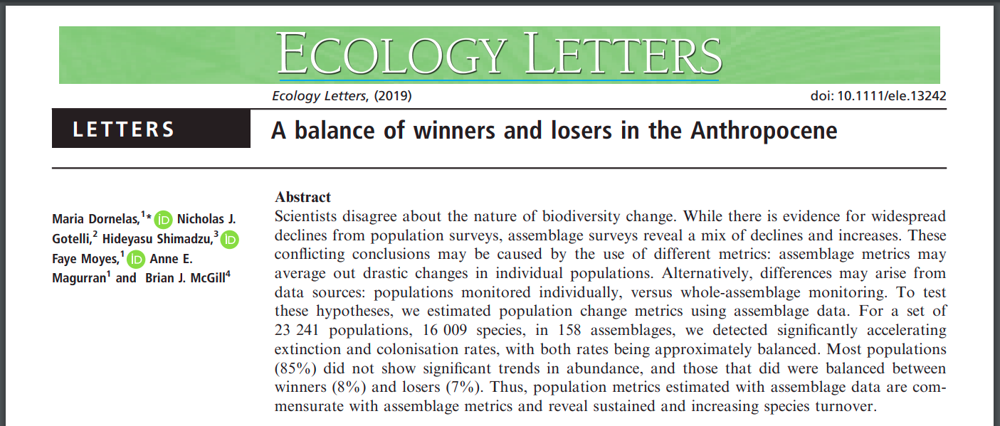
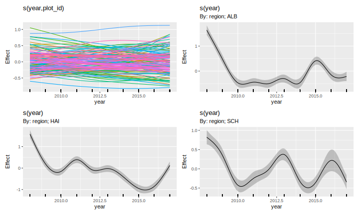

```{r setup, include=FALSE, cache=FALSE}
options(htmltools.dir.version = FALSE)
knitr::opts_chunk$set(cache = TRUE, dev = 'svg', echo = FALSE, message = FALSE, warning = FALSE,
                      fig.height=6, fig.width = 1.777777*6)

library("curl")
library('here')
library('mgcv')
library('gratia')
library('ggplot2')
library('purrr')
library('mvnfast')
library("tibble")
library('gganimate')
library('tidyr')
library("knitr")
library("viridis")
library('readr')
library('dplyr')
library('patchwork')

## plot defaults
theme_set(theme_minimal(base_size = 16, base_family = 'Fira Sans'))

## constants
anim_width <- 1000
anim_height <- anim_width / 1.77777777
anim_dev <- 'png'
anim_res <- 200
```

# Two case studies

1. Trends in biodiversity data, and

2. Shifting seasonality in cases of lyme borreliosis

---
class: inverse middle center subsection

# Biodiversity trends

---

# Biodiversity losses

.center[
]

???

Many of us will be familiar with trends like this

Global biodiversity is in trouble

Wherever we look we see declining populations

Living Plant Index is an average measure of change (so some time series in a region could be increasing even if overall we have a decline in LPI)

---

# Biodiversity losses..?

.center[
]

Vellend *et al* (2013) *PNAS*

.center[
]

Dornelas *et al* 2014 *Science*

???

But studies showing declining biodiversity are not without issue

There has been a decade or more long discussion about the extent to which diversity is declining

---

# Biodiversity losses..?

.center[
]

Gonzalez *et al* (2016) *Ecology*

.center[
]

Vellend *et al* 2017 *Ecology*

---

# Biodiversity gains & losses

.center[
]

Dornelas *et al* (2019) *Ecology Letters*

In part disagreement relates to *population* versus *assemblage* level metrics

Partly due to how the data are analysed

---

# Linear trends

Majority of these large-scale syntheses use linear trend models

.center[
]

Fig 2 from Dornelas *et al* (2014) *Science*

$y_i$ sometimes transformed

---

# Seibold et al 2019

Analysed 150 grassland and 140 forest sites across 3 regions of Germany 2008&ndash;2017

.center[
]

Seibold *et al* (2019) *Nature*

---

# Declining arthopod biomass, abundance, and richness

.center[
]

Seibold *et al* (2019) *Nature*

---

# Declining arthopod biomass, abundance, and richness

* Grasslands

    * Biomass &#8595; 67%

    * Abundance &#8595; 78%

    * Richness &#8595; 36%

* Forests (30 site subset)

    * Biomass &#8595; 41%

    * Richness &#8595; 36%

---

# Good and bad years

.center[

]

Fournier *et al* (2019) *Conservation Biology* [doi: 10.1111/cobi.13371](https://doi.org/10.1111/cobi.13371)

---

# Good and bad years

Daskalova *et al* (2021) attempted to account for this effect using random effects of `Year`

.center[

]

Daskalova *et al* (2021) *Insect Conservation & Diversity*

---

# Generalized Additive Models

Random effects of `Year` are one form of common trend

Year-to-year variation about some overall mean

--

Random effects are a special case of a penalized spline

--

GAMs

---

# Generalized Additive Models

<br />


.references[Source: [GAMs in R by Noam Ross](https://noamross.github.io/gams-in-r-course/)]

GAMs are an intermediate-complexity model

* can learn from data without needing to be informed by the user
* remain interpretable because we can visualize the fitted features
* fit smooth functions using penalized splines

---

```{r smooth-fun-animation, results = FALSE, echo = FALSE}
f <- function(x) {
    x^11 * (10 * (1 - x))^6 + ((10 * (10 * x)^3) * (1 - x)^10)
}

draw_beta <- function(n, k, mu = 1, sigma = 1) {
    rmvn(n = n, mu = rep(mu, k), sigma = diag(rep(sigma, k)))
}

weight_basis <- function(bf, x, n = 1, k, ...) {
    beta <- draw_beta(n = n, k = k, ...)
    out <- sweep(bf, 2L, beta, '*')
    colnames(out) <- paste0('f', seq_along(beta))
    out <- as_tibble(out)
    out <- add_column(out, x = x)
    out <- pivot_longer(out, -x, names_to = 'bf', values_to = 'y')
    out
}

random_bases <- function(bf, x, draws = 10, k, ...) {
    out <- rerun(draws, weight_basis(bf, x = x, k = k, ...))
    out <- bind_rows(out)
    out <- add_column(out, draw = rep(seq_len(draws), each = length(x) * k),
                      .before = 1L)
    class(out) <- c("random_bases", class(out))
    out
}

plot.random_bases <- function(x, facet = FALSE) {
    plt <- ggplot(x, aes(x = x, y = y, colour = bf)) +
        geom_line(lwd = 1, alpha = 0.75) +
        guides(colour = "none")
    if (facet) {
        plt + facet_wrap(~ draw)
    }
    plt
}

normalize <- function(x) {
    rx <- range(x)
    z <- (x - rx[1]) / (rx[2] - rx[1])
    z
}

set.seed(1)
N <- 500
data <- tibble(x     = runif(N),
               ytrue = f(x),
               ycent = ytrue - mean(ytrue),
               yobs  = ycent + rnorm(N, sd = 0.5))

k <- 10
knots <- with(data, list(x = seq(min(x), max(x), length = k)))
sm <- smoothCon(s(x, k = k, bs = "cr"), data = data, knots = knots)[[1]]$X
colnames(sm) <- levs <- paste0("f", seq_len(k))
basis <- pivot_longer(cbind(sm, data), -(x:yobs), names_to = 'bf')
basis

set.seed(2)
bfuns <- random_bases(sm, data$x, draws = 20, k = k)

smooth <- bfuns %>%
    group_by(draw, x) %>%
    summarise(spline = sum(y)) %>%
    ungroup()

p1 <- ggplot(smooth) +
    geom_line(data = smooth, aes(x = x, y = spline), lwd = 1.5) +
    labs(y = 'f(x)', x = 'x') +
    theme_minimal(base_size = 16, base_family = 'Fira Sans')

smooth_funs <- animate(
    p1 + transition_states(draw, transition_length = 4, state_length = 2) + 
    ease_aes('cubic-in-out'),
    nframes = 200, height = anim_height, width = anim_width, res = anim_res,
    dev = anim_dev)

anim_save('resources/spline-anim.gif', smooth_funs)
```

# Splines

.center[]

---

# Splines formed from basis functions

```{r basis-functions, fig.height=6, fig.width = 1.777777*6, echo = FALSE}
ggplot(basis,
       aes(x = x, y = value, colour = bf)) +
    geom_line(lwd = 2, alpha = 0.5) +
    guides(colour = "none") +
    labs(x = 'x', y = 'b(x)') +
    theme_minimal(base_size = 20, base_family = 'Fira Sans')
```

???

Splines are built up from basis functions

Here I'm showing a cubic regression spline basis with 10 knots/functions

We weight each basis function to get a spline. Here all the basis functions have the same weight so they would fit a horizontal line

---

# Weight basis functions &#8680; spline

```{r basis-function-animation, results = 'hide', echo = FALSE}
bfun_plt <- plot(bfuns) +
    geom_line(data = smooth, aes(x = x, y = spline),
              inherit.aes = FALSE, lwd = 1.5) +
    labs(x = 'x', y = 'f(x)') +
    theme_minimal(base_size = 14, base_family = 'Fira Sans')

bfun_anim <- animate(
    bfun_plt + transition_states(draw, transition_length = 4, state_length = 2) + 
    ease_aes('cubic-in-out'),
    nframes = 200, height = anim_height, width = anim_width, res = anim_res, dev = anim_dev)

anim_save('resources/basis-fun-anim.gif', bfun_anim)
```

.center[]

???

But if we choose different weights we get more wiggly spline

---

# Maximize penalized log-likelihood &#8680; &beta;

```{r basis-functions-anim, results = "hide", echo = FALSE}
sm2 <- smoothCon(s(x, k = k, bs = "cr"), data = data, knots = knots)[[1]]$X
beta <- coef(lm(ycent ~ sm2 - 1, data = data))
wtbasis <- sweep(sm2, 2L, beta, FUN = "*")
colnames(wtbasis) <- colnames(sm2) <- paste0("F", seq_len(k))
## create stacked unweighted and weighted basis
basis <- as_tibble(rbind(sm2, wtbasis)) %>%
    add_column(x = rep(data$x, times = 2),
               type = rep(c('unweighted', 'weighted'), each = nrow(sm2)),
               .before = 1L)
##data <- cbind(data, fitted = rowSums(scbasis))
wtbasis <- as_tibble(rbind(sm2, wtbasis)) %>%
    add_column(x      = rep(data$x, times = 2),
               fitted = rowSums(.),
               type   = rep(c('unweighted', 'weighted'), each = nrow(sm2))) %>%
    pivot_longer(-(x:type), names_to = 'bf')
basis <- pivot_longer(basis, -(x:type), names_to = 'bf')

p3 <- ggplot(data, aes(x = x, y = ycent)) +
    geom_point(aes(y = yobs), alpha = 0.2) +
    geom_line(data = basis,
              mapping = aes(x = x, y = value, colour = bf),
              lwd = 1, alpha = 0.5) +
    geom_line(data = wtbasis,
              mapping = aes(x = x, y = fitted), lwd = 1, colour = 'black', alpha = 0.75) +
    guides(colour = "none") +
    labs(y = 'f(x)', x = 'x') +
    theme_minimal(base_size = 16, base_family = 'Fira Sans')

crs_fit <- animate(p3 + transition_states(type, transition_length = 4, state_length = 2) + 
                   ease_aes('cubic-in-out'),
                   nframes = 100, height = anim_height, width = anim_width, res = anim_res,
                   dev = anim_dev)

anim_save('./resources/gam-crs-animation.gif', crs_fit)
```

.center[]

???

Fitting a GAM involves finding the weights for the basis functions that produce a spline that fits the data best, subject to some constraints

---

# GAM summary

1. GAMs give us a framework to model flexible nonlinear relationships

2. Use little functions (**basis functions**) to make big functions (**smooths**)

3. Use a **penalty** to trade off wiggliness/generality 

4. Need to make sure your smooths are **wiggly enough**

---

# Arthropod abundance

.center[
]

---

# Arthropod abundance

Negative binomial GAM fitted to single site (AEG1)

.center[
]

---

# Grassland arthropod abundance

Our example:

* Abundance of all identified Arthropods

* Grassland sites only

* Models

    * Linear global and site-specific trends (random slopes & intercepts)
    * Smooth trend of `year` plus `site` random intercepts
    * Regional smooths of `year` plus `site` random intercepts
    * Regional smooths of `year`, `site` specific *random* smooths
    * Regional smooths of `year`, year-to-year effects, `site` specific *random* smooths

---

# Random smooths?

* Random intercepts
* Random slopes
* Random smooths?

Random smooths yield a separate smooth for each subject

Share a wiggliness penalty (plus $\lambda$ for intercepts & slopes)

But individual trends can have different shape

---

# Random smooth model

`site` specific *random* smooths

.center[
]

Pedersen _et al_ (2019) [PeerJ **7**:e6876](https://doi.org/10.7717/peerj.6876)

---

# Model A

Regional smooths of `year`, `site` specific *random* smooths

.center[
]

---

# Model B

Regional smooths of `year`, year-to-year effects, `site` specific *random* smooths

.center[
]

---

# Results

* Model A (without Y2Y effects): AIC 15122 (255.7 EDF)
* Model B (with Y2Y effects): AIC 15123 (254.2 EDF)
* Equivalent mixed linear trend model (with Y2Y effects): AIC 15468 (111.8 EDF)

Use year-to-year effects or not?

--

(For these data) **A** and **B** are different ways to decompose the temporal effects

* Without Y2Y &#8594;	wigglier regional smooths
* With Y2Y &#8594; less wiggly regional smooths

???

Even with relatively simple data, GAMs yield much better fit than linear equiv.

---

# Nothing new under the sun

Fewster, Buckland, *et al* (2000) *Ecology*

(except Simon Wood's excellent {mgcv} software & ability to fit random smooths)

---

# Summary

How we model trends in biodiversity data can change our view of losses and gains

Using "smooth" trends gives much better fit for the arthropod data here

Y2Y effects and / or smooth trends represent different decompositions of the *temporal* effect

Non/linear methods needed if we want to assess changes in rates of change

---
class: inverse subsection center middle

# Lyme borreliosis

```{r lyme-borreliosis-setup, echo = FALSE, results = "hide"}
# Analysis of the Lyme borreliosis weekly incidence data from Norway

# Data are from:
# The emergence and shift in seasonality of Lyme borreliosis in Northern Europe
# Goren et al (2023) doi.org/10.1098/rspb.2022.2420

# Packages
pkgs <- c("tibble", "readr", "dplyr", "here", "tidyr", "ggplot2", "mgcv",
    "gratia")
vapply(pkgs, library, FUN.VALUE = logical(1L), character.only = TRUE,
    logical.return = TRUE)

f <- here("data", "goren-et-al", "lyme-borreliosis.csv")

lyme <- read_csv(f,
    col_types = "-iiiiiiiiiii")

lyme <- lyme |>
    mutate(date = as.Date(paste(yrwk, "1"), format = "%Y%U%u"),
    fyear = factor(year),
    pop = pop / 100000) |>
    select(-yrwk)
```

---

# Lyme borreliosis

.row[

.col-9[
Lyme disease is a zoonotic infection

Caused by bacteria (spirochetes) in the *Borrelia burgdorferi* sensu lato complex

Transmitted by infected tick larvae & nymphs in the genus *Ixodes* during blood meals

Common vector-borne disease in N hemisphere

Reported cases of Lyme borreliosis have increased in recent decades
]

.col-3[

.center[
```{r insert-tick-img}
knitr::include_graphics("resources/Adult_deer_tick.jpg")
```
]

.smaller[Adult deer tick, *Ixodes scapularis*

(Source: Scott Bauer)
]

]

]
???

Increased in both number and geographical range

---

# Tick-borne disease & climate

.center[
```{r insert-tick-schematic, out.width = "90%"}
knitr::include_graphics("resources/gilbert-tick-zoonoses-schematic.png")
```
]

.smaller[source: Gilbert (2021) *Annu. Rev. Entomol.* [10.1146/annurev-ento-052720-094533](https://doi.org/10.1146/annurev-ento-052720-094533)

???

Figure caption from Gilbert (2021)

Schematic diagram showing how climate change can affect ticks directly (by changing oviposition, development, mortality rates, and activity) and indirectly (by changing habitat and host species and abundance). Climate change can, in turn, affect tick-borne pathogen infection risk in humans by directly affecting human behavior (e.g., outdoor recreation) and indirectly affecting pathogen transmission rates and prevalence via hosts and ticks. The relative importance of each pathway is challenging to ascertain.

]

---

# Tick-borne disease & climate

Aim of Goren *et al* (2023) was to study

1. the incidence, and

2. the seasonal timing

of Lyme borreliosis at the northern limit of the range in Europe

---

# Cases of Lyme borreliosis in Norway

```{r lyme-cases-plot, echo = FALSE, out.width = "95%", fig.align = "center"}
lyme |>
    ggplot(aes(x = week, y = cases, group = year, colour = year)) +
    geom_line(linewidth = 0.75)  +
    scale_color_viridis_c(option = "magma",
        guide = guide_colourbar(barheight = unit(0.5, "npc"))) +
    theme_grey(base_size = 18) +
    labs(x = "Week", y = "Number of cases per week", colour = NULL)
```
.small[
Data: Goren *et al* (2023) *Proc. Biol. Sci.* [10.1098/rspb.2022.2420](https://doi.org/10.1098/rspb.2022.2420)
]

---

# Climate change in Norway

Compared to 1979&ndash;2008 reference period

Annual mean temperature increased by ~ 0.5&#8451;

Winter temperatures increase by ~1&#8451;

Growing season increased by 1&ndash;2 weeks nationally

Annual precipitation increased by ~3% per decade

---

# GAM for seasonal data

Assume weekly cases are distributed Negative binomial

$$
\texttt{cases}_i \sim \mathcal{NB}(\mu_i, \theta)
$$

Lots of ways to decompose these data; settled on

.small[
$$
\log (\mathbb{E}(\texttt{cases}_i) ) = \beta_0 + f(\texttt{week}_i , \texttt{year}_i) + \log(\texttt{population}_i)
$$
]

where

$$
f(\texttt{week}_i , \texttt{year}_i)
$$

is a tensor product smooth (main effects plus interaction)

---

# GAM for seasonal data

Model code looks like:

```{r lyme-gam-code, echo = TRUE, cache = TRUE}
m <- bam(cases ~ s(week, bs = "cc", k = 20) +
                 s(year, k = 25) +
                 ti(week, year, bs = c("cc", "tp"), k = c(20, 20)) +
                 offset(log(pop)),
    data = lyme,
    family = nb(),
    method = "fREML",
    knots = list(week = c(0.5, 52.5)),
    discrete = TRUE,
    nthreads = 4)
```

Using lots of *mgcv* tricks to fit the model *fast* as some decompositions take a long time to fit with `gam()`

Decomposed tensor product into main smooth effects plus a pure smooth interaction

---

# Estimated smooth functions

```{r lyme-draw, cache = TRUE, out.width = "95%", fig.align = "center"}
draw(m, rug = FALSE) + plot_layout(ncol = 2) & theme_grey(base_size = 14)
```

---

# Estimated seasonal curves

```{r lyme-plot-fitted-curves, cache = TRUE, out.width = "95%", fig.align = "center"}
# predict to find week of peak in each year
ds <- data_slice(m, week = evenly(week, n = 100), year = unique(year),
    pop = log(100000))

fv <- fitted_values(m, data = ds, scale = "response")

fv |>
    ggplot(aes(x = week, y = fitted, group = year, colour = year)) +
    geom_line(linewidth = 1) +
    scale_colour_viridis_c(option = "magma",
        guide = guide_colourbar(barheight = unit(0.5, "npc"))) +
    labs(y = "Number of cases per 100,000 population", x = "Week",
        title = "Annual seasonal trend in cases of Lyme borreliosis",
        colour = NULL) +
    theme_grey(base_size = 18)
```

---

# How has timing of peak changed?

Easy &mdash; using data in previous figure, find week in each year where $\widehat{\texttt{cases}}_j$ is maximal

--

Harder &mdash; account for the uncertainty in the model & put an uncertainty band on $\widehat{\texttt{peak}}_j$

--

GAMs are an *empirical Bayesian* model so we can simulate from the posterior distribution of the model to get answers to questions like this

---

# How has timing of peak changed?

*gratia* 📦 has functions to make doing this easy(-ish)

```{r lyme-posterior-simulation, cache = TRUE, echo = TRUE}
ds2 <- data_slice(m, week = unique(week), year = unique(year),
    pop = log(100000))
ds2 <- ds2 |>
    add_column(row = seq_len(nrow(ds2)), .before = 1L)

fs2 <- fitted_samples(m, data = ds2, n = 10000, seed = 42, scale = "response")

fs2 <- fs2 |>
    left_join(ds2, by = join_by(row)) |>
    select(-pop)

peak_week <- fs2 |>
    group_by(year, draw) |>
    slice_max(order_by = fitted, n = 1) |>
    group_by(year) |>
    summarise(peak = quantile(week, prob = 0.5),
        lower_ci = quantile(week, prob = 0.055),
        upper_ci = quantile(week, prob = 0.945))
```

---

# How has timing of peak changed?

```{r lyme-plot-peak-week, cache = TRUE, out.width = "95%", fig.align = "center"}
peak_week |>
    ggplot(aes(x = year, y = peak)) +
    geom_pointrange(aes(ymin = lower_ci, ymax = upper_ci)) +
    labs(y = "Week of peak cases", x = NULL,
        caption = "89% credible interval") +
    theme_grey(base_size = 18)
```

---

# Slides

* &copy; Simpson (2022-2023) [](http://creativecommons.org/licenses/by/4.0/)

* HTML Slide deck [gavinsimpson.github.io/au-ecoscience-2023/](https://gavinsimpson.github.io/au-ecoscience-2023/)

* RMarkdown [https://github.com/gavinsimpson/au-ecoscience-2023](https://github.com/gavinsimpson/au-ecoscience-2023)

* DOI: 10.5281/zenodo.7706659 [](https://doi.org/10.5281/zenodo.7706659)

* @ucfagls on Twitter

---

# Representing trends

With the penalty idea we can imagine several ways to account for temporal effects in GAMs

1. Fixed year effects
2. Random year effects
3. MRF equivalent of AR
4. Smooth
5. Linear
6. ...

1 & 5 typically not penalized (but could be via `paraPen`)

Could combine these hierarchically
